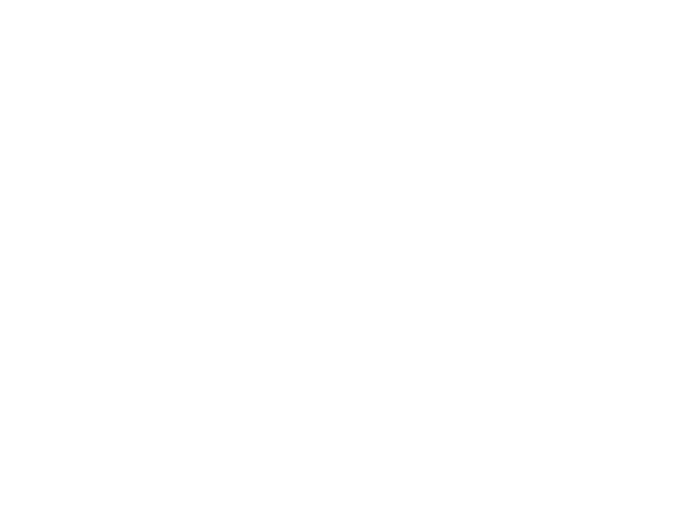
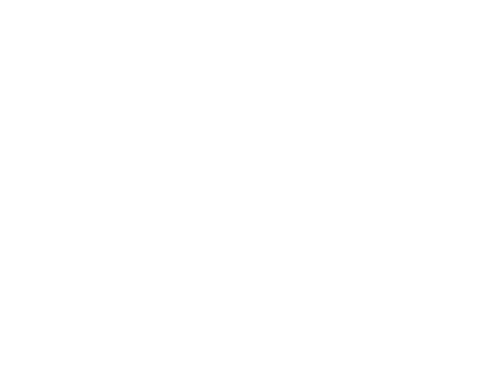
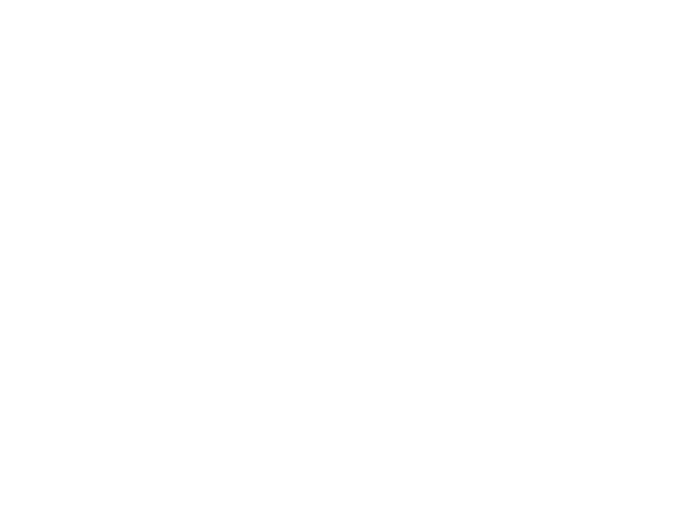
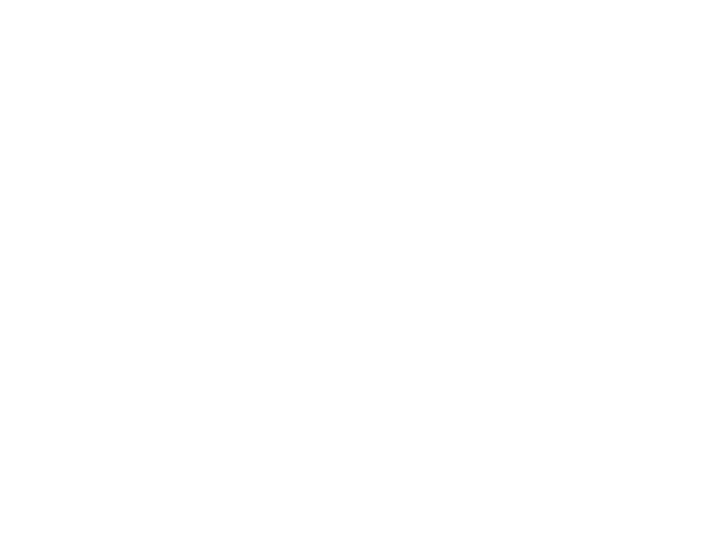

# Winterthur Bike Traffic Analysis

## Projektübersicht

In diesem Projekt werden öffentliche Veloverkehrsdaten der Stadt Winterthur analysiert. Ziel ist es, zeitliche Muster im Veloverkehr zu erkennen und ein einfaches Regressionsmodell zu entwickeln, das die Anzahl gezählter Velos pro Messintervall vorhersagt.

Der Datensatz enthält Informationen zu Zählstellen, Fahrtrichtungen, Zeitpunkten, geografischen Koordinaten und zur gezählten Anzahl Velos. Aus der Zeitspalte werden zusätzliche Merkmale wie Stunde, Wochentag und Monat erstellt. Diese Features werden verwendet, um Unterschiede im Veloverkehr nach Tageszeit, Wochentag und Saison zu untersuchen.

Das Projekt umfasst Datenaufbereitung, Feature Engineering, explorative Datenanalyse, Modellvergleich, Hyperparameter-Tuning und die Evaluation des finalen Modells. Für den Modellvergleich werden mehrere Regressionsmodelle getestet, darunter Lineare Regression, Decision Tree Regressor und Random Forest Regressor. Der Decision Tree Regressor erzielt im Vergleich die beste Leistung und wird anschliessend mithilfe von Cross-Validation weiter optimiert.

Die finale Modellbewertung erfolgt anhand von MAE, RMSE und R². Die ähnlichen Fehlerwerte auf Trainings- und Testdaten zeigen, dass kein starkes Overfitting vorliegt. Gleichzeitig zeigt das moderate R², dass die verwendeten Features nur einen Teil der Schwankungen im Veloverkehr erklären können. Zusätzliche externe Daten wie Wetter, Feiertage, Schulferien oder lokale Events könnten die Vorhersagequalität in einem nächsten Schritt verbessern.

## Daten

Für dieses Projekt wurden öffentliche Veloverkehrsdaten der Stadt Winterthur verwendet. Der Datensatz enthält Messungen von verschiedenen Velozählstellen innerhalb der Stadt. Jede Zeile beschreibt ein Messintervall mit Informationen zur Zählstelle, Fahrtrichtung, Uhrzeit, geografischen Koordinaten und zur Anzahl gezählter Velos.

Aus der Zeitspalte `zeit_von` wurden zusätzliche Merkmale wie Stunde, Wochentag und Monat erstellt. Diese Features dienen dazu, zeitliche Muster im Veloverkehr zu analysieren und als Eingabevariablen für das Regressionsmodell zu verwenden.

Die Zielvariable des Modells ist `anzahl`, also die Anzahl gezählter Velos pro Messintervall.

## Methoden

In diesem Projekt wurden folgende Methoden angewendet:

* Datenbereinigung mit pandas
* Feature Engineering aus Zeitdaten
* Explorative Datenanalyse
* Visualisierung mit seaborn und matplotlib
* Modellvergleich verschiedener Regressionsmodelle
* Hyperparameter-Tuning mit Cross-Validation
* Evaluation mit MAE, RMSE und R²
* Analyse von Feature Importance und Vorhersagefehlern

## Visualisierungen

### Durchschnittlicher Veloverkehr nach Tageszeit

### Veloverkehr nach Wochentag und Stunde

### Modellvergleich

### In-Sample vs. Out-of-Sample Evaluation

## Resultate

Im Modellvergleich erzielte der Decision Tree Regressor die beste Leistung. Das finale Modell wurde mit Cross-Validation optimiert und anschliessend auf Trainings- und Testdaten evaluiert.

Die wichtigsten Resultate:

* Bestes Modell: Decision Tree Regressor
* MAE: ca. 21 Velos pro Messintervall
* R²: ca. 0.23
* Kein starkes Overfitting erkennbar

Der MAE zeigt, dass das Modell im Durchschnitt um etwa 21 Velos pro Messintervall danebenliegt. Das R² von ca. 0.23 zeigt, dass das Modell einen Teil der Schwankungen im Veloverkehr erklären kann, die Vorhersagekraft jedoch durch die verfügbaren Features begrenzt ist.

## Limitationen

Eine wichtige Limitation des Projekts ist, dass nur Informationen aus dem Veloverkehrsdatensatz selbst verwendet wurden. Externe Einflussfaktoren wurden nicht berücksichtigt.

Mögliche zusätzliche Datenquellen für eine Verbesserung des Modells wären:

* Wetterdaten
* Feiertage
* Schulferien
* lokale Events
* Baustellen oder Verkehrsumleitungen
* saisonale Besonderheiten

Diese Faktoren könnten den Veloverkehr stark beeinflussen und die Vorhersagequalität in einem nächsten Schritt verbessern.

## Technologien

Für das Projekt wurden folgende Technologien verwendet:

* Python
* pandas
* NumPy
* seaborn
* matplotlib
* scikit-learn
* Jupyter Notebook
